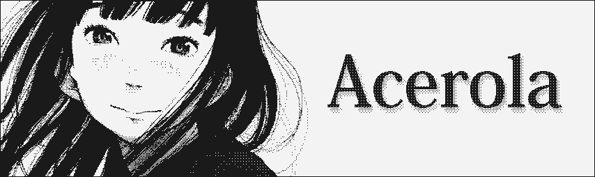
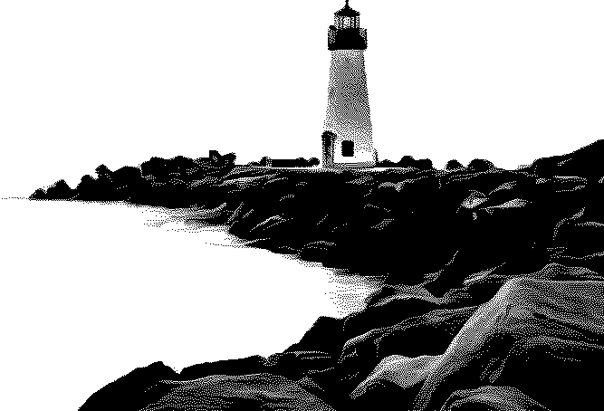

Hi, I'm Garrett and I'm a technical artist/graphics developer. 

Let me show you what you've been missing.

💬 Now:
- Converting my post processing shaders to fx files for ReShade.

💭 Later:
- Look into weather effects.

💤 Previously:
- Texture hacked Super Smash Bros Melee and made custom skins for the game.
- Created a tool for testing several [tone mappers](https://youtu.be/wbn5ULLtkHs) in Unity.
- Created several shaders for [faking pixel art](https://youtu.be/8wOUe32Pt-E).
- Simulated color blindness for usability engineering.

 

