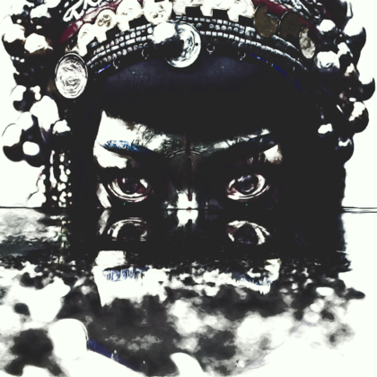

Hi, I'm Acerola and I'm a graphics programmer.

Let me show you what you've been missing.

💬 Now:
- Reading about gpu buoyancy simulations.

💭 Later:
- Look into weather effects.
- Explore compute particle systems for Unity.
- Implement all currently relevant anti aliasing techniques. 

💤 Previously:

 

  

  

  

  
 

